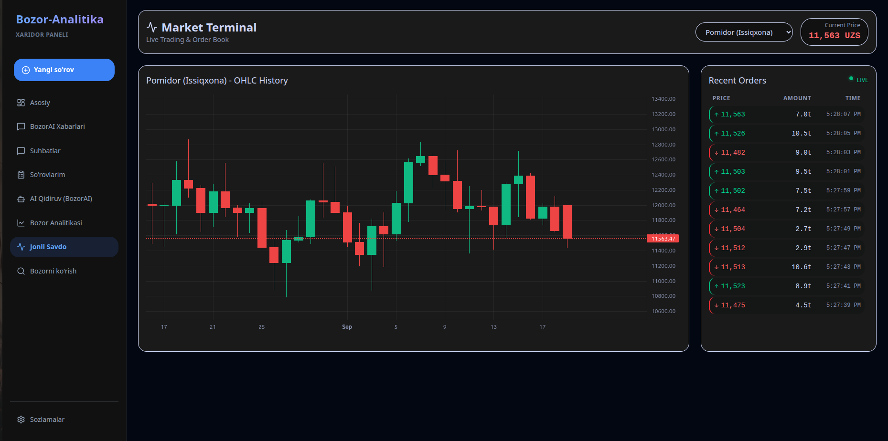
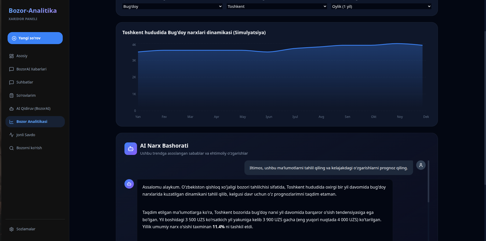
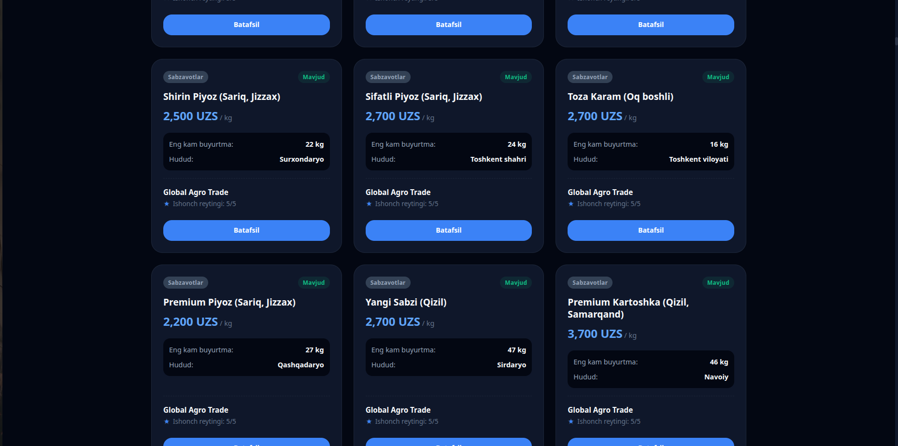

  
  
  # E-Bozor: O'zbekiston B2B Ulgurji Savdo Ekotizimi
  
  **Agro savdodan boshlanib, barcha B2B ulgurji bitimlar va xalqaro eksport shartnomalariga transformatsiya bo'luvchi raqamli platforma.**

  
  
  

  [e-bazar-six.vercel.app](https://e-bazar-six.vercel.app) | [+998 50 723 33 22](tel:+998507233322)

   

  

---

## 📖 Loyiha Haqida (About the Project)

**E-Bozor** (Bozor-Analitika) bu O'zbekistondagi eng yirik universal B2B ulgurji platformasi bo'lishni maqsad qilgan raqamli ekotizimdir. Hozirgi kunda Qishloq Xo'jaligi (Agro) savdosi bilan boshlanib, kelajakda barcha turdagi xomashyo va B2B bitimlarini qamrab oladi. Platforma sun'iy intellekt (AI) yordamida bozor tahlili, narxlar prognozi va optimal xaridor-sotuvchi mosligini ta'minlaydi.

### 🛑 Bozor Muammolari
O'zbekiston B2B va Agro bozoridagi asosiy to'siqlar:
- **70% Vositachilar Ulushi**: Dehqonlar va yirik xaridorlar o'rtasida juda ko'p vositachilar (olib-sotarlar) mavjud.
- **Xaridor va Narx Noaniqligi**: Bozor narxlari shaffof emas, real vaqt rejimida narxlarni kuzatish qiyin.
- **Yuridik va Til To'siqlari**: Xalqaro eksport va shartnomalar tuzishda huquqiy va tarjima muammolari.

### 💡 Bizning Yechim: Bozor-Analitika
- 💻 **B2B Savdo Veb-Platformasi**: Shaffof va xavfsiz savdo maydonchasi.
- 🧠 **AI Match (BozorAI)**: Sun'iy intellekt yordamida eng mos hamkorlarni topish va bozor tahlilini olish.
- 🌍 **Eksport & AI Tarjimon**: Xalqaro bozorga chiqishni osonlashtiruvchi avtomatlashtirilgan yechimlar.

---

## 🚀 Asosiy Imkoniyatlar va Interfeys (Features & UI)

### 📊 Bozor Analitikasi va AI Narx Bashorati
Sun'iy intellekt (Gemini 3.5 Flash) yordamida tarixiy narxlar dinamikasi (Kunlik, Haftalik, Oylik, Yillik) tahlil qilinadi va kelajakdagi o'zgarishlar bashorat qilinadi.

  

### 💬 AI Qidiruv va Xabarlar (BozorAI)
Foydalanuvchilar o'zlariga kerakli mahsulotni oddiy suhbat (chat) orqali izlashlari, shartlarni kelishishlari va AI orqali narxlarni optimallashtirishlari mumkin.

  

### 🛒 Mahsulotlar Katalogi (Ulgurji Savdo)
Hududlar bo'yicha filterlash, ishonch reytingi va narxlarning shaffof ko'rinishi.

  

---

## 📈 Biznes Model va Iqtisodiyot

| Ko'rsatkich | Tavsif |
| --- | --- |
| **Komissiya** | Pure **2%** Komissiya Modeli (Faqat muvaffaqiyatli xavfsiz bitimdan so'ng) |
| **Oylik To'lov** | **$0** (Obunasiz, shaffof tizim) |
| **Xavfsiz Bitim** | Shartlar oldindan kelishiladi, ikki tomon roziligidan so'ng jarayon boshlanadi. |

### Unit Economics (Birlik Iqtisodiyoti)
- **CAC (Customer Acquisition Cost):** ~$85
- **LTV (Lifetime Value):** $1440
- **Rentabellik:** 16x LTV/CAC ROI. Har bir mijozdan 3 oyda ilk foyda olinadi.

---

## 🌍 Bozor Hajmi va Strategik Transformatsiya

**Maqsadli Bozor (O'zbekiston):** 80,000+ fermer va 300,000+ dehqon xo'jaliklari.

- **TAM (Umumiy Bozor):** $25 Mlrd (Agro) | $33.8 Mlrd (Universal B2B)
- **SAM (Erishish mumkin bo'lgan B2B):** $8.5 Mlrd
- **SOM (Ilk Maqsadli Daromad):** $240,000

### Transformatsiya Bosqichlari:
1. **Phase 1 (2027-yil):** O'zbekiston Agro B2B Yetakchiligi ($240,000 ARR, 500+ fermer)
2. **Phase 2 (2028-2029 yillar):** Universal B2B savdo platformasi ($600,000 ARR)
3. **Phase 3 (2030-yil):** Markaziy Osiyo Bozori ($1 mln ARR)

---

## 👥 Jamoa (Team)

- **Shixnazar Baxromov** – Founder & Software Engineer (2 yillik tajriba, Dental CRM loyihasi)
- **Mirodil Azizov** – CFO (Concordia Universiteti magistri, Moliya sohasida 6+ yillik tajriba)
- **Temur Xolmuxammedov** – Software Engineer (Turin Politexnika magistri, 4+ yillik tajriba)
- **Saidmurotova Aziza** – Grafik Dizayner (2 yillik tajriba)
- **Hasanboyeva Sevara** – Kopirayter
- **Abror Hoshimov** – Advisor (Head of Department of Economics and Management, TTPU)

---

  <i>"Agro savdodan boshlab — O'zbekiston va Mintaqadagi Barcha B2B Ulgurji Bitimlar Platformasiga!"</i>
    
  <b>O'zbekistondagi eng yirik universal B2B ulgurji platformasiga birgalikda investitsiya kiriting.</b>

